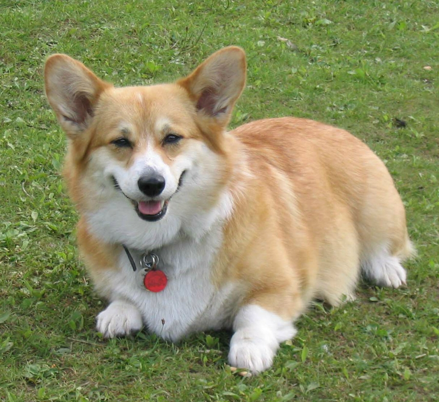

# hw1 
# Обо мне
- *Петрова Юлия*
- ~18 лет~ почти 19
- Родилась в **Москве**
- Учусь в НИУ ВШЭ
- *_Обожаю искусство, музыку, танцы, рисование_*
- https://vk.com/ohmymoon Моя страница в вк
*****
**Мое расписание *на ближайшие несколько дней* **:

|    26.01     |     27.01    |     28.01         |
| :----------- | :----------: | -----------:      |
| Пробежка, вуз| За покупками!|  Д/з, чтение      |
| Д/з, сериал  |Вечер с семьей| встреча с друзьями|
******
# Увлечения
+ Путешествие
+ Рисование
+ Языки
+ Страны *(те, которыми я больше заинтересована и те, которые не входят в обычный список мест для путешествий)*
+ Кофе
+ Вкусная еда *(салат из лосося, лазанья, маффин, Смузи, шоколад, вареная курица)*
### Немного больше об увлечениях
**Путешествия**
* Была почти во всех странах Европы: Германия, Франция, Португалия, Австрия Словения, Хорватия, Великобритания, Финляндия и тд.
* Также в нескольких скандинавских: Норвегия, Швеция, Щвейцария

**Страны**

1. ***Южная Корея*** - мое самое любимое место на планете!

 

2. ***Англия***

********

**Языки**

Языки, которыми я владею/ буду владеть
- [х] английский
- [ ] испанский
- [х] китайский
- [х] корейский
- [ ] французский

## Любимые цитаты:
> Сердце можно лечить только сердцем.

> Самые светлые моменты уходят так быстро и безвозвратно.

> Невозможно победить того, кто не сдается.

## На этом все. Спасибо за внимание!

